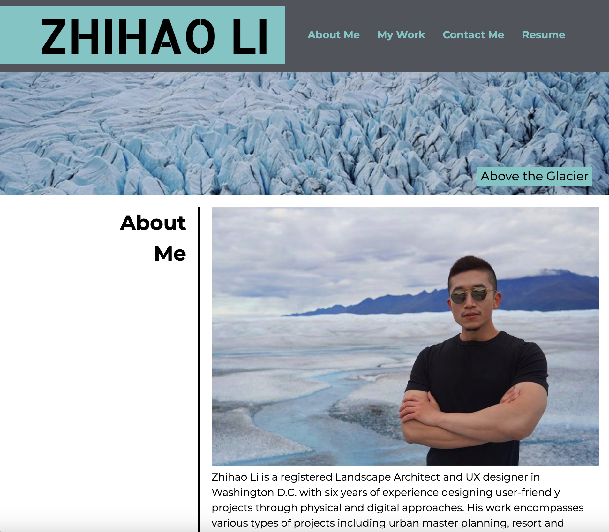
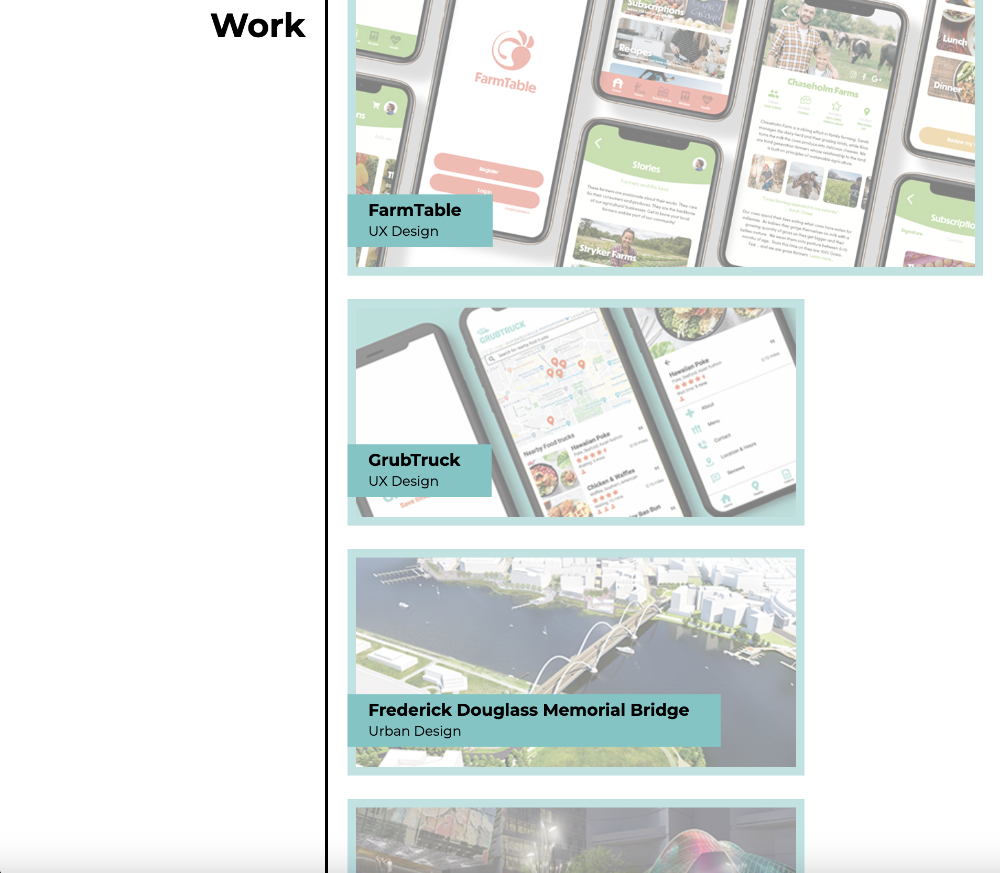
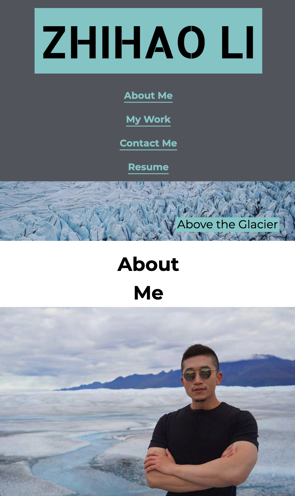
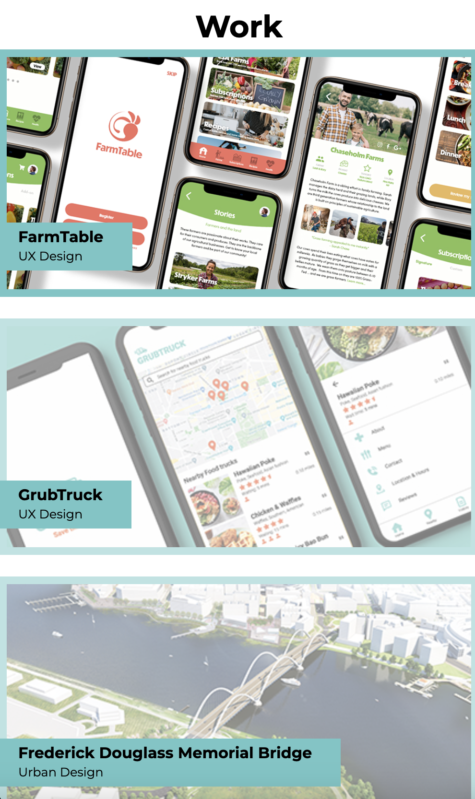

# Portfolio Website

OBJECTIVE

Develop a main page of my portfolio website to facilitate job applications by showing my works online. 

STRATEGIES

1. The main page must include my name, a recent photo, and links to sections about me, my work, and how to contact me.
2. The navigtion must link to corresponding sections when clicking.
3. The first project image should be the largest in size.
4. The projct images must link to deployed applications.
5. Develop a responsive layout that adapts to different viewport on different devices.

SITE URL

https://lzh1990214.github.io/portfolio/

WIREFRAME

SITE SCREENSHOT (DESKTOP/LAPTOP DISPLAY)

SITE SCREENSHOT (MOBILE DISPLAY)

